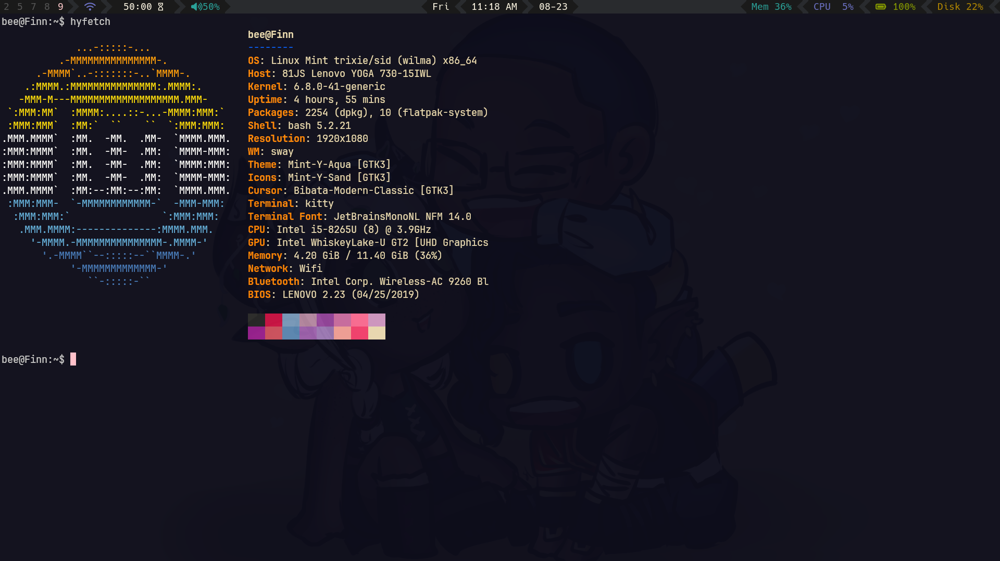
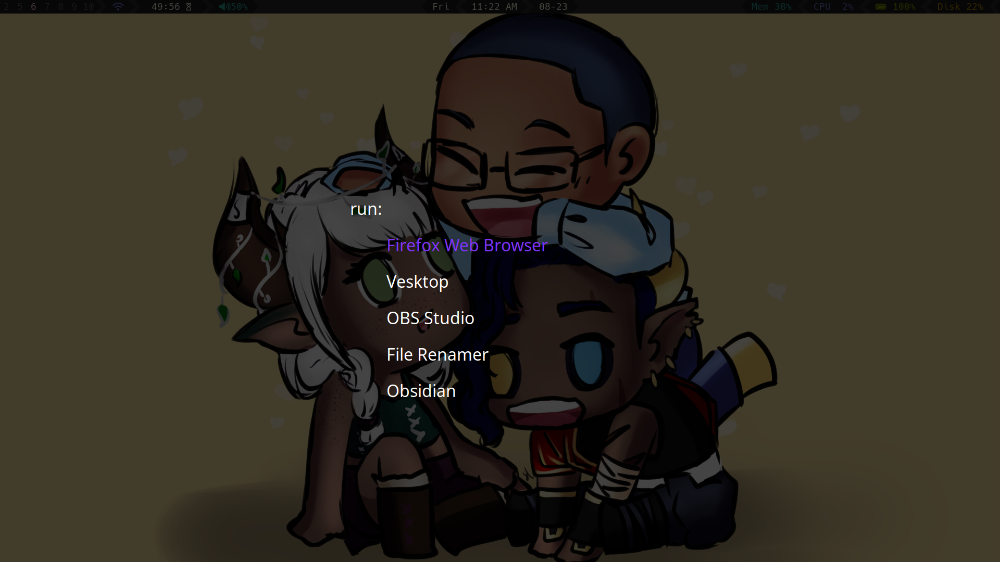

<div align=center>
    
    <br>
    Dotfiles for my main productivity setup, Jake
    <br>
    <br>
</div>

**NOTES:** 
- clone with ```git clone --recursive```
- run with ```sudo -H ./install.sh``` 




